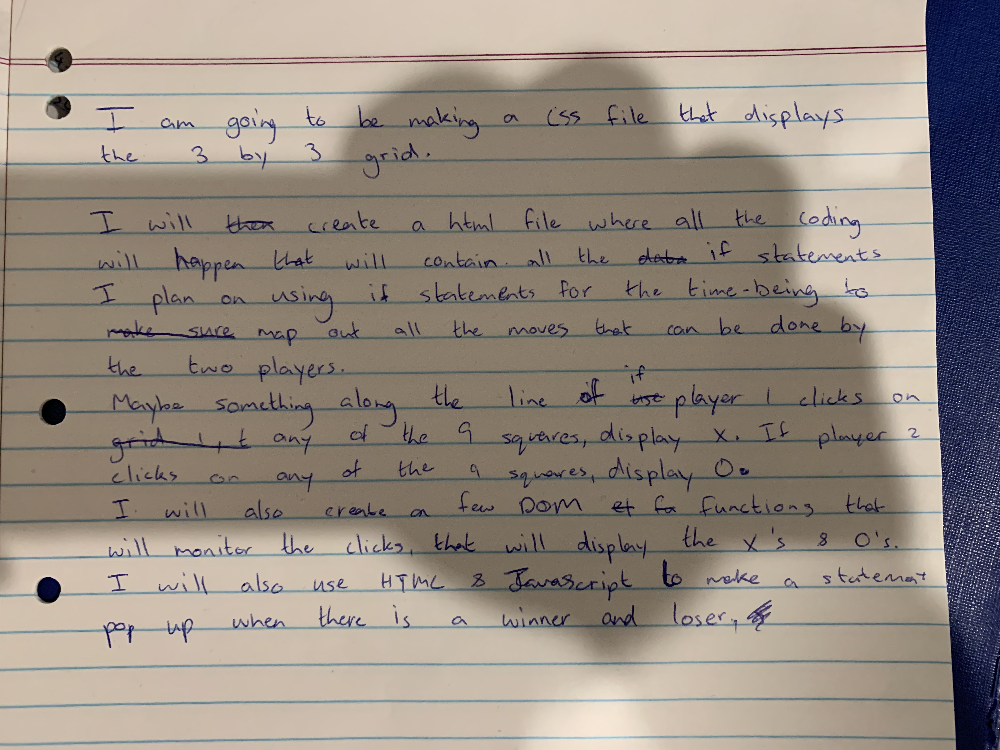

# Tic-Tac-Toe

## Rules of the Game
The rules are quite simple. Each player is assigned a symbol, either X or O. Your job is to get your symbol to show up in the grid in 3 different consecutive squares, either horizontally, vertically, or diagonally. The grid is a 3 by 3 squares, and if netiher player gets thier symbol 3 consecutive times, then it's a draw. You also take alternate turns of 1 until all the squares are filled or until a winner is emerged.

## Planning and Problem Solving

My initial plan on the first day is in the picture below
	

The next day i came up with a smaller plan with simple steps highlighting the order in which  should do my project.

## Cool Tech
I used the programming languages HTML, CSS, and JavaScript to make my Tic-Tac-Toe game. My game is quite simple in terms of design and layout and animations. I was going for the authentic feel that you get when you play the game on paper. It has simple black drawings on a white background, giving you the nostalgic feel you got when you were playing in your books during school to pass time in class.

## Bugs to Fix
There are a few small things that are broken. For example, when you play the game and you win, an alert will pop up. You have to exit the alert and refresh the browser, so that the board resets again and the previus game disappears. If you exit the alert, and continue to click the empty squares, you can actually continue to add X's or O's, each time a new alert popping up. These new alerts also bring out false statements, for example, it will say 'O' wins if O just finsihed its turn, or it will say X 'wins' if X just finished its turn. It will continue to do this if you keep clicking on the empty squares. But it can be easily avoided if you just refresh the browser after a winner has been displayed.

## Lessons Learnt
The lessons I learnt was to be really thorough and pay attention to small details when doing the coding task. Because missing important things like paranthesis can make all the difference, or making sure the variable name stays consistent throughout the whole project, and to spell it correctly each time and not add anything else to the variable name as well.

## Future Features
If i could keep woirking on this, i would first put some finishing touches on my game to fix the bug. I would have a function named resetBoard where after a player wins, the game after a certain amout of time resets.
I would also add a small theme behind it, like Tom and Jerry charcters instead of a simple X and O, or like some colours to make it more colourful and pretty.
Add some transitions, so that when a winner is displayed, instead of it being displayed in an alert, it is displayed in a transition that pops up in colourful headings.